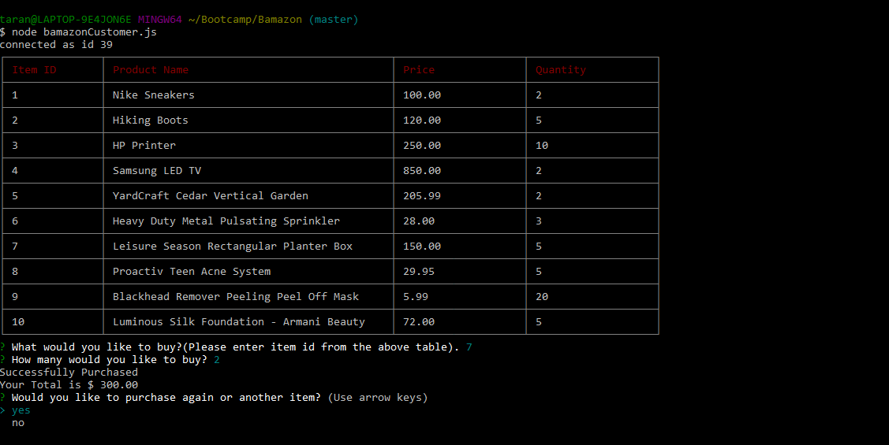

# Bamazon

University of Toronto Coding Bootcamp Week 12 Assignment.  
Technologies used: NodeJS || MySQL || Inquirer & CLI-Table.

## Challenge1: bamazonCustomer.js

Product Table with Details for user to buy. User can select id and quantity how many they want to purchase. Then it shows the Total of their Purchase.
